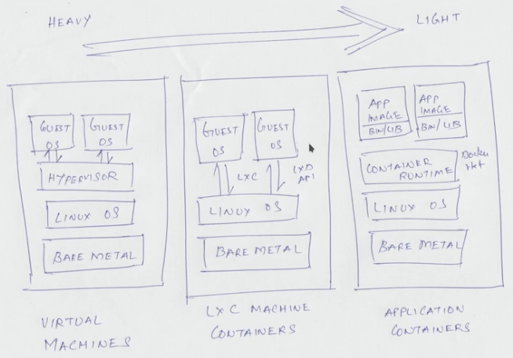
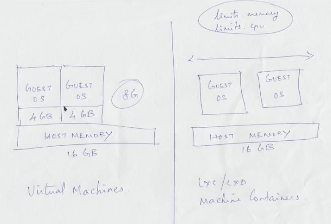

- Below image shows difference between VMs, LXC containers and Docker containers.


- Unlike VM, the complete RAM of hostmachine will be available to LXC container but only uses required portion of it, instead of completely allocating it. We can set a limit also for that.


- Most commonly used LXC commands while using it.


- For installing LXC, I followed this official documentation [link](https://linuxcontainers.org/lxc/getting-started/)
  - on ubuntu: ```sudo apt install -y lxc```

- After that, you can check installation done succesfull or not:
  - client/cli: ```which lxc```
  - daemon/runtime: ```which lxd```
  - To check packages installed on debian based distro, should display lxd and lxd-client: ```dpkg -l | grep lxd```
 
- Next steps of configuration:
  - To list groups on the linux host machine: ```groups```
  - User should be added to lxd group: ```sudo gpasswd -a $USER lxd```
  - To check user added to that group: ```getent group lxd```
  - To reload permissions: ```newgrp lxd```
 
- Initialize lxd on the linux machine:
  ```
  sudo lxd init
  ## Answer below prompts, most of them default, I provided entry as dir for storage-backed, others are default
  Would you like to use LXD clustering? (yes/no) [default=no]: 
  Do you want to configure a new storage pool? (yes/no) [default=yes]: 
  Name of the new storage pool [default=default]: 
  Name of the storage backend to use (dir, lvm, zfs, ceph, btrfs) [default=zfs]: dir
  Would you like to connect to a MAAS server? (yes/no) [default=no]: 
  Would you like to create a new local network bridge? (yes/no) [default=yes]: 
  What should the new bridge be called? [default=lxdbr0]: 
  What IPv4 address should be used? (CIDR subnet notation, “auto” or “none”) [default=auto]: 
  What IPv6 address should be used? (CIDR subnet notation, “auto” or “none”) [default=auto]: 
  Would you like the LXD server to be available over the network? (yes/no) [default=no]: 
  Would you like stale cached images to be updated automatically? (yes/no) [default=yes] 
  Would you like a YAML "lxd init" preseed to be printed? (yes/no) [default=no]: 
  ```
  
- storage list
```
lxc storage list

To start your first container, try: lxc launch ubuntu:20.04
Or for a virtual machine: lxc launch ubuntu:20.04 --vm

+---------+-------------+--------+------------------------------------------------+---------+
|  NAME   | DESCRIPTION | DRIVER |                     SOURCE                     | USED BY |
+---------+-------------+--------+------------------------------------------------+---------+
| default |             | dir    | /var/snap/lxd/common/lxd/storage-pools/default | 1       |
+---------+-------------+--------+------------------------------------------------+---------+
```
- Remote repositories from where lxc images are downloaded.
```
sudo lxc remote list
+----------------------+---------------------------------------------------+---------------+-------------+--------+--------+
|         NAME         |                        URL                        |   PROTOCOL    |  AUTH TYPE  | PUBLIC | STATIC |
+----------------------+---------------------------------------------------+---------------+-------------+--------+--------+
| images               | https://images.lxd.canonical.com                  | simplestreams | none        | YES    | NO     |
+----------------------+---------------------------------------------------+---------------+-------------+--------+--------+
| local (current)      | unix://                                           | lxd           | file access | NO     | YES    |
+----------------------+---------------------------------------------------+---------------+-------------+--------+--------+
| ubuntu               | https://cloud-images.ubuntu.com/releases          | simplestreams | none        | YES    | YES    |
+----------------------+---------------------------------------------------+---------------+-------------+--------+--------+
| ubuntu-daily         | https://cloud-images.ubuntu.com/daily             | simplestreams | none        | YES    | YES    |
+----------------------+---------------------------------------------------+---------------+-------------+--------+--------+
| ubuntu-minimal       | https://cloud-images.ubuntu.com/minimal/releases/ | simplestreams | none        | YES    | YES    |
+----------------------+---------------------------------------------------+---------------+-------------+--------+--------+
| ubuntu-minimal-daily | https://cloud-images.ubuntu.com/minimal/daily/    | simplestreams | none        | YES    | YES    |
+----------------------+---------------------------------------------------+---------------+-------------+--------+--------+
```

- show local images
```
 lxc image list
+-------+-------------+--------+-------------+--------------+------+------+-------------+
| ALIAS | FINGERPRINT | PUBLIC | DESCRIPTION | ARCHITECTURE | TYPE | SIZE | UPLOAD DATE |
+-------+-------------+--------+-------------+--------------+------+------+-------------+
```
- show images from a remote repo above.
```
sudo lxc image list images:
sudo lxc image list ubuntu: 
```

- ubuntu images are directly available in ubuntu remote repo above, but for centos, it is available in the images repo above.
```
sudo lxc image list images:cent 
+--------------------------------+--------------+--------+---------------------------------------+--------------+-----------------+----------+-------------------------------+
|             ALIAS              | FINGERPRINT  | PUBLIC |              DESCRIPTION              | ARCHITECTURE |      TYPE       |   SIZE   |          UPLOAD DATE          |
+--------------------------------+--------------+--------+---------------------------------------+--------------+-----------------+----------+-------------------------------+
| centos/9-Stream (3 more)       | d05c7ebd7bd1 | yes    | CentOS 9-Stream amd64 (20240818_0023) | x86_64       | CONTAINER       | 115.07MB | Aug 18, 2024 at 12:00am (UTC) |
+--------------------------------+--------------+--------+---------------------------------------+--------------+-----------------+----------+-------------------------------+
| centos/9-Stream (3 more)       | ee0e77cc6c62 | yes    | CentOS 9-Stream amd64 (20240818_0023) | x86_64       | VIRTUAL-MACHINE | 735.31MB | Aug 18, 2024 at 12:00am (UTC) |
+--------------------------------+--------------+--------+---------------------------------------+--------------+-----------------+----------+-------------------------------+
| centos/9-Stream/arm64 (1 more) | 21e448ace5bb | yes    | CentOS 9-Stream arm64 (20240812_0021) | aarch64      | CONTAINER       | 110.85MB | Aug 12, 2024 at 12:00am (UTC) |
+--------------------------------+--------------+--------+---------------------------------------+--------------+-----------------+----------+-------------------------------+
| centos/9-Stream/cloud (1 more) | cfc362176655 | yes    | CentOS 9-Stream amd64 (20240818_0024) | x86_64       | CONTAINER       | 131.43MB | Aug 18, 2024 at 12:00am (UTC) |
+--------------------------------+--------------+--------+---------------------------------------+--------------+-----------------+----------+-------------------------------+
| centos/9-Stream/cloud (1 more) | e7b5613b7294 | yes    | CentOS 9-Stream amd64 (20240818_0024) | x86_64       | VIRTUAL-MACHINE | 756.39MB | Aug 18, 2024 at 12:00am (UTC) |
+--------------------------------+--------------+--------+---------------------------------------+--------------+-----------------+----------+-------------------------------+
| centos/9-Stream/cloud/arm64    | 9d16f1861f86 | yes    | CentOS 9-Stream arm64 (20240812_0021) | aarch64      | CONTAINER       | 126.99MB | Aug 12, 2024 at 12:00am (UTC) |
+--------------------------------+--------------+--------+---------------------------------------+--------------+-----------------+----------+-------------------------------+
```

- To launch a container: ```lxc launch ubuntu:16.04```
- To list running containers: ```lxc list```
- To stop a container: ```lxc stop container_name```
- To start a stopped container: ```lxc start container_name```
- To delete a stopped container: ```lxc delete container_name```
- To stop and delete a running container: ```lxc delete --force container_name```
- To clone a container: ```lxc copy myubuntu myanotherubuntu```
- To connect to the shell of container: ```lxc exec myvm bash```
- Connect to shell using run as user option: ```lxc exec myanotherubuntu su - ubuntu```
- Other containers can be accessed from one of your lxc container using its dns: <containername>.lxd, check with ping command.
- To get complete statistic of a container: ```lxc info myvm | less```
- To see the configuration of a container: ```lxc config show myvm | less```

## Profiles
- To show profiles: ```lxc profile list```
- To see details of a particular profile: ```lxc profile show default```

## Limits
- To set limits at container level: ```lxc config set myvm limits.memory 512MB```
- To set limit at profile level, you can edit the profile: ```lxc profile edit default```
  
