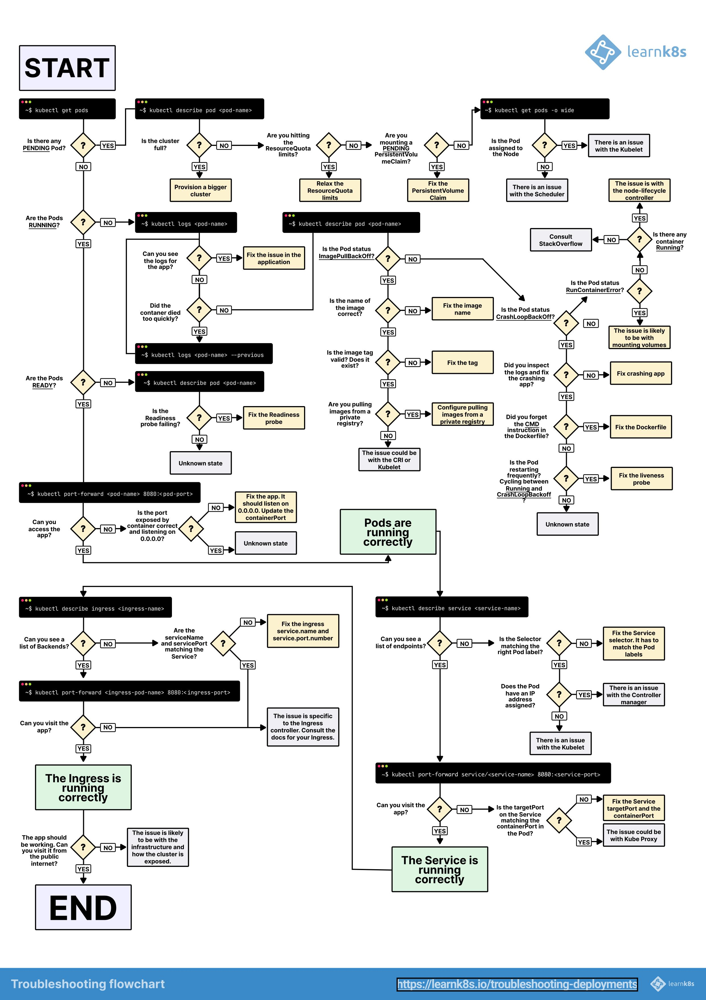

 Kubernetes troubleshooting can be a complex process, but here's a detailed step-by-step guide to help you diagnose and resolve issues:

1. Understand the problem:
   - Clearly define the symptoms of the issue
   - Identify which components or resources are affected
   - Determine when the problem started occurring

2. Check cluster health:
   - Verify node status: 
     ```
     kubectl get nodes
     ```
   - Check cluster events:
     ```
     kubectl get events --sort-by=.metadata.creationTimestamp
     ```

3. Examine pod status:
   - List all pods:
     ```
     kubectl get pods --all-namespaces
     ```
   - Check specific pod details:
     ```
     kubectl describe pod <pod-name> -n <namespace>
     ```

4. Review pod logs:
   - Check current logs:
     ```
     kubectl logs <pod-name> -n <namespace>
     ```
   - Check previous container logs:
     ```
     kubectl logs <pod-name> -n <namespace> --previous
     ```

5. Investigate configuration issues:
   - Review deployments:
     ```
     kubectl get deployments -n <namespace>
     kubectl describe deployment <deployment-name> -n <namespace>
     ```
   - Check services:
     ```
     kubectl get services -n <namespace>
     kubectl describe service <service-name> -n <namespace>
     ```
   - Examine ingress configurations:
     ```
     kubectl get ingress -n <namespace>
     kubectl describe ingress <ingress-name> -n <namespace>
     ```

6. Verify resource allocation:
   - Check resource usage:
     ```
     kubectl top nodes
     kubectl top pods -n <namespace>
     ```
   - Review resource quotas:
     ```
     kubectl describe resourcequota -n <namespace>
     ```

7. Investigate networking issues:
   - Verify DNS resolution:
     ```
     kubectl run -it --rm --restart=Never busybox --image=busybox:1.28 -- nslookup kubernetes.default
     ```
   - Check network policies:
     ```
     kubectl get networkpolicies -n <namespace>
     ```

8. Examine storage-related problems:
   - Check persistent volumes:
     ```
     kubectl get pv
     kubectl describe pv <pv-name>
     ```
   - Verify persistent volume claims:
     ```
     kubectl get pvc -n <namespace>
     kubectl describe pvc <pvc-name> -n <namespace>
     ```

9. Investigate control plane components:
   - Check control plane pod status:
     ```
     kubectl get pods -n kube-system
     ```
   - Review control plane logs:
     ```
     kubectl logs <control-plane-pod> -n kube-system
     ```

10. Verify RBAC configurations:
    - Check roles and role bindings:
      ```
      kubectl get roles,rolebindings -n <namespace>
      ```
    - Examine cluster roles and bindings:
      ```
      kubectl get clusterroles,clusterrolebindings
      ```

11. Investigate custom resource issues:
    - List custom resources:
      ```
      kubectl get crd
      ```
    - Check specific custom resource:
      ```
      kubectl get <custom-resource-name> -n <namespace>
      kubectl describe <custom-resource-name> <resource-instance> -n <namespace>
      ```

12. Use debugging tools:
    - Run debug container:
      ```
      kubectl debug -it <pod-name> --image=ubuntu --target=<container-name>
      ```
    - Use port-forwarding for direct access:
      ```
      kubectl port-forward <pod-name> <local-port>:<pod-port>
      ```

13. Check Kubernetes API server:
    - Verify API server health:
      ```
      kubectl get --raw='/healthz?verbose'
      ```
    - Check API server logs:
      ```
      kubectl logs kube-apiserver-<node-name> -n kube-system
      ```

14. Investigate etcd issues:
    - Check etcd health:
      ```
      kubectl exec -it etcd-<node-name> -n kube-system -- etcdctl endpoint health
      ```
    - Verify etcd member list:
      ```
      kubectl exec -it etcd-<node-name> -n kube-system -- etcdctl member list
      ```

15. Review third-party integrations:
    - Check status of installed Helm charts:
      ```
      helm list -A
      ```
    - Verify Operators and their custom resources

16. Analyze cluster-wide metrics:
    - Use Prometheus and Grafana if available
    - Check Kubernetes dashboard if installed

17. Review recent changes:
    - Check version control system for recent commits
    - Review CI/CD pipeline logs for recent deployments

18. Consult documentation and community resources:
    - Kubernetes official documentation
    - Cloud provider-specific Kubernetes documentation
    - Kubernetes GitHub issues and Stack Overflow

19. Use advanced debugging techniques:
    - Packet capturing for network issues
    - Core dumps for application crashes
    - Profiling for performance problems

20. Document findings and resolution:
    - Record the problem, steps taken, and solution
    - Update runbooks or troubleshooting guides
    - Share knowledge with the team

Remember to always follow the principle of least privilege when executing commands, and be cautious when making changes in production environments. Troubleshooting should ideally be performed in a staging environment first, if possible.

Below picture might help to dig in detail.

